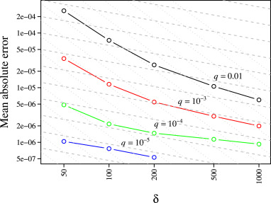

# RedisBloom T-Digest Documentation

The T-Digest data structure can be used to estimate rank statistics such as the median, percentiles, cumulative distributions, as well as trimmed means with high accuracy, particularly near the tails (quantiles near 0 or 1). It can be included 
in the family of "Approximate Query Processing" Algorithms.

Separately computed sketches can be combined with little or no loss in accuracy.

This [open access article](https://www.sciencedirect.com/science/article/pii/S2665963820300403) can be used to understand further the intricacies and applications of the T-Digest.

## Create / Reset

### TDIGEST.CREATE

Allocate the memory and initialize the t-digest.

```
TDIGEST.CREATE {key} {compression}
```

#### Parameters:

* **key**: The name of the sketch.
* **compression**: The compression parameter. 100 is a common value for normal uses. 1000 is extremely large. See the further notes bellow. 


**Further notes on compression vs accuracy:**
Constructing a T-Digest requires a compression parameter which determines the size of the digest and accuracy of quantile estimation. 
The scaling of accuracy versus the compression parameter is illustrated in the following figure retrieved from ["Ted Dunning, The t-digest: Efficient estimates of distributions, Software Impacts,Volume 7,2021"](https://www.sciencedirect.com/science/article/pii/S2665963820300403).



#### Complexity

O(1)

#### Return

OK on success, error otherwise

#### Example

```
TDIGEST.CREATE t-digest 100
```

### TDIGEST.RESET

Reset the sketch to zero - empty out the sketch and re-initialize it.

```
TDIGEST.RESET {key}
```

#### Parameters:

* **key**: The name of the sketch.
    
#### Complexity

O(1)

#### Return

OK on success, error otherwise

#### Example

```
TDIGEST.RESET t-digest
```


## Update

### TDIGEST.ADD

Adds one or more samples to a sketch.

```
TDIGEST.ADD {key} {val} {weight} [ {val} {weight} ] ...
```

#### Parameters:

* **key**: The name of the sketch.
* **val**: The value to add.
* **weight**: The weight of this point.
    
#### Complexity

O(N) , where N is the number of samples to add

#### Return

OK on success, error otherwise

#### Example

```
TDIGEST.ADD key 1500.0 1.0
```


## Merge

### TDIGEST.MERGE

Merges all of the values from 'from' to 'this' sketch.

```
TDIGEST.MERGE {to-key} {from-key}
```

#### Parameters:

* **to-key**: Sketch to copy values to.
* **from-key**: Sketch to copy values from.

#### Complexity

O(N), where N is the number of centroids 

#### Return

OK on success, error otherwise

#### Example

```
TDIGEST.MERGE to-sketch from-sketch
```

## Query

### TDIGEST.MIN

Get minimum value from the sketch.  Will return __DBL_MAX__ if the sketch is empty.

```
TDIGEST.MIN {key}
```

#### Parameters:

* **key**: The name of the sketch.

#### Complexity

O(1)

#### Return

Minimum value from the sketch.  Will return __DBL_MAX__ if the sketch is empty.

#### Example 

```
1127.0.0.1:6379> TDIGEST.MIN key
"10"
```


### TDIGEST.MAX

Get maximum value from the sketch.  Will return __DBL_MIN__ if the sketch is empty.

```
TDIGEST.MAX {key}
```

#### Parameters:

* **key**: The name of the sketch.

#### Complexity

O(1)

#### Return

Maximum value from the sketch.  Will return __DBL_MIN__ if the sketch is empty.

#### Example 

```
1127.0.0.1:6379> TDIGEST.MAX key
"10000"
```


### TDIGEST.QUANTILE

Returns an estimate of the cutoff such that a specified fraction of the data
added to this TDigest would be less than or equal to the cutoff.

```
TDIGEST.QUANTILE {key} {quantile}
```

#### Parameters:

* **key**: The name of the sketch.
* **quantile**: The desired fraction ( between 0 and 1 inclusively ).
    
#### Complexity

O(1)

#### Return

Double value estimate of the cutoff such that a specified fraction of the data
added to this TDigest would be less than or equal to the cutoff.

#### Example

```
127.0.0.1:6379> TDIGEST.QUANTILE key 0.5
"100"
```

### TDIGEST.CDF

Returns the fraction of all points added which are <= value.

```
TDIGEST.CDF {key} {value}
```

#### Parameters:

* **key**: The name of the sketch.
* **quantile**: upper limit for which the fraction of all points added which are <= value.
    
#### Complexity

O(1)

#### Return

Double fraction of all points added which are <= value.

#### Example

```
127.0.0.1:6379> TDIGEST.CDF key 10
"0.041666666666666664"
```


## General

### TDIGEST.INFO

Returns compression, capacity, total merged and unmerged nodes, the total compressions 
made up to date on that key, and merged and unmerged weight.

```
TDIGEST.INFO {key}
```

### Parameters:

* **key**: The name of the sketch.

### Complexity

O(1) 

#### Example

```
127.0.0.1:6379> tdigest.info key
 1) Compression
 2) (integer) 100
 3) Capacity
 4) (integer) 610
 5) Merged nodes
 6) (integer) 3
 7) Unmerged nodes
 8) (integer) 2
 9) Merged weight
10) "120"
11) Unmerged weight
12) "1000"
13) Total compressions
14) (integer) 1
```
